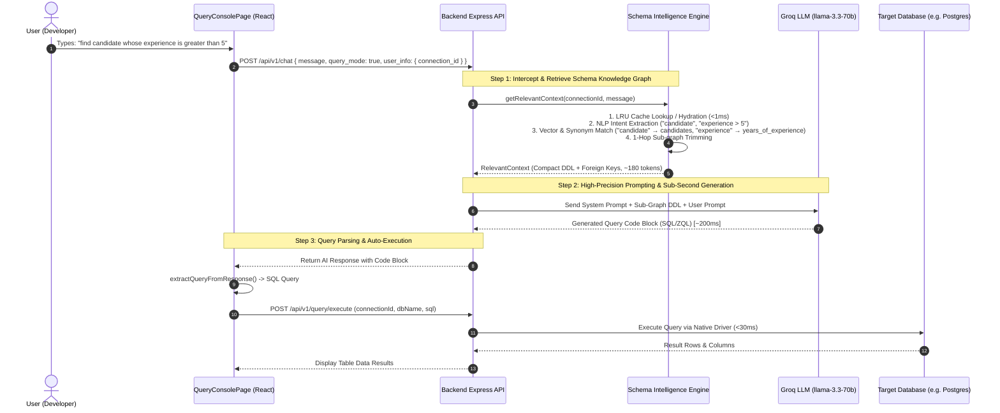

#  Ziuro-AI & Schema Intelligence — End-to-End AI Flow Documentation

This document explains the end-to-end architecture, execution pipeline, and data flow of **Ziuro-AI** and the **Schema Intelligence Engine (Knowledge Graph)** in ZiuroDB.

---

##  Table of Contents
1. [High-Level Architecture](#-high-level-architecture)
2. [End-to-End Execution Sequence](#-end-to-end-execution-sequence)
3. [The 5-Step AI Execution Flow](#-the-5-step-ai-execution-flow)
4. [Complete Step-by-Step Realistic Example](#-complete-step-by-step-realistic-example)
   - [Scenario: "find candidate whose experience is greater than 5"](#scenario-find-candidate-whose-experience-is-greater-than-5)
5. [Autonomous Agent vs. Query Mode Comparison](#-autonomous-agent-vs-query-mode-comparison)
6. [Performance & Latency Benchmarks](#-performance--latency-benchmarks)

---

##  High-Level Architecture

Ziuro-AI integrates a **5-tier intelligent pipeline** connecting the frontend user interface, backend Express API, Schema Intelligence Knowledge Graph engine, Groq LLM inference, and native database connection adapters:

```
┌─────────────────────────────────────────────────────────────────────────────┐
│                          ZiuroDB Frontend UI                                │
│          Query Console Page (Query Mode / Autonomous Agent Mode)            │
└─────────────────────────────────────┬───────────────────────────────────────┘
                                      │ HTTP POST /api/v1/chat
                                      ▼
┌─────────────────────────────────────────────────────────────────────────────┐
│                          ZiuroDB Backend API                                │
│                   (Express.js + groqChat.service.ts)                        │
└───────┬─────────────────────────────┬─────────────────────────────┬─────────┘
        │                             │                             │
        │ 1. Get Context              │ 2. System Prompt            │ 3. Execute
        ▼                             ▼                             ▼
┌──────────────┐             ┌─────────────────┐           ┌─────────────────┐
│   Schema     │             │    Groq LLM     │           │   Target DB     │
│ Intelligence │             │  (llama-3.3-70b)│           │ (PostgreSQL,    │
│    Engine    │             └─────────────────┘           │ MySQL, MongoDB, │
│(KnowledgeGraph)                                          │   Firestore)    │
└──────────────┘                                           └─────────────────┘
```

---

##  End-to-End Execution Sequence



---

##  The 5-Step AI Execution Flow

### Step 1: User Input & Payload Assembly (Frontend)
- The user enables **Query Mode** (`queryOnlyMode = true`) in the Ziuro-AI Copilot drawer or console toolbar.
- The user enters a natural language request.
- The frontend packages the request with user metadata and the active `connection_id`:

```json
{
  "message": "find candidate whose experience is greater than 5",
  "session_id": "sess_89f1a23c",
  "query_mode": true,
  "user_info": {
    "name": "Shani Kumar",
    "email": "shani@example.com",
    "role": "admin",
    "active_connection": "Recruitment_DB (postgresql)",
    "active_db": "hr_recruitment",
    "connection_id": "66a1b2c3d4e5f67890123456"
  }
}
```

---

### Step 2: Schema Intelligence Interception (Backend)
- `backend/src/services/groqChat.service.ts` intercepts the request.
- If `userInfo.connection_id` is present, it invokes the **Schema Intelligence Engine**:
  ```typescript
  const context = await schemaEngine.getRelevantContext(userInfo.connection_id, message);
  ```
- The engine checks its **In-Memory LRU Cache (`GraphCache`)**. If the graph is not in RAM, it loads it instantly from compressed `.graph.gz` storage or runs a parallel database catalog scan (`PostgreSQLScanner` / `MySQLScanner` / `MongoDBScanner`).

---

### Step 3: Sub-Graph Extraction & Semantic Trimming
The engine executes 4 internal operations:
1. **NLP Intent Extraction (`PromptAnalyzer`)**:
   - **Target Entities:** `["candidate"]`
   - **Filter Condition Keywords:** `["experience", "greater", "5"]`
   - **Detected SQL Operation:** `SELECT`
2. **Business Entity & Alias Classification (`SemanticClassifier` & `BusinessDictionary`)**:
   - Matches `"candidate"` $\rightarrow$ `Person` / `Candidate` business entity (Synonyms: `applicant`, `candidate_profile`, `job_seeker`).
   - Resolves database table `candidates_profile` or `candidates`.
   - Maps `"experience"` $\rightarrow$ database column `years_of_experience` / `exp_years`.
3. **Sub-Graph Traversal & Trimming (`ContextRetriever`)**:
   - Traverses 1 hop around the `candidates` node.
   - **Trims away 95%+ of unrelated database tables** (e.g. `invoices`, `system_logs`, `audit_events`).
4. **Compact DDL & NL Generation**:
   - Converts the minimal sub-graph into lightweight DDL representation (~180 tokens).

---

### Step 4: System Prompt Construction & LLM Generation
- The backend constructs the final prompt sent to Groq LLM (`llama-3.3-70b-versatile`):

```text
SYSTEM PROMPT:
You are Ziuro-AI, an intelligent database agent for ZiuroDB.
Logged-in User: Shani Kumar (admin)
Active Connection: Recruitment_DB (postgresql) | Active Database: hr_recruitment

🚨 STRICT QUERY MODE IS ACTIVE 🚨
1. Output ONLY the database query/statement (SQL, ZQL, MongoDB query).
2. DO NOT include greetings or conversational intros.
3. Enclose the query in a single standard markdown code block (```sql ... ```).

🧠 SCHEMA INTELLIGENCE KNOWLEDGE GRAPH CONTEXT (High Precision Sub-Graph):
-- Table "candidates" — Job applicant profile (~4,200 rows)
CREATE TABLE "candidates" (
  "id" integer PRIMARY KEY,
  "full_name" varchar NOT NULL,
  "email" varchar NOT NULL,
  "years_of_experience" numeric NOT NULL,
  "status" varchar NOT NULL
);

Current Date/Time: Saturday, August 1, 2026 at 12:05 AM

USER PROMPT: "find candidate whose experience is greater than 5"
```

- **Groq LLM Response (~200ms)**:

````markdown
```sql
SELECT id, full_name, email, years_of_experience, status 
FROM candidates 
WHERE years_of_experience > 5 
ORDER BY years_of_experience DESC;
```
````

---

### Step 5: Query Parsing & Auto-Execution (Frontend)
1. The frontend receives the AI response message.
2. `extractQueryFromResponse(text)` uses regex `/```(?:sql|zql|mongodb)?\s*\n?([\s\S]*?)```/i` to extract the clean SQL string:
   `SELECT id, full_name, email, years_of_experience, status FROM candidates WHERE years_of_experience > 5 ORDER BY years_of_experience DESC;`
3. Frontend auto-executes the query:
   `api.executeQuery(connectionId, activeDbName, queryToExecute)`
4. The native PostgreSQL adapter executes the SQL directly against the database connection in **< 30ms**.
5. Results are populated in the main Query Console grid!

---

##  Complete Step-by-Step Realistic Example

### Scenario: `"find candidate whose experience is greater than 5"`

#### 1. Input Prompt
```
"find candidate whose experience is greater than 5"
```

#### 2. Knowledge Graph Node Lookup
```json
{
  "matched_table": "candidates",
  "matched_columns": ["years_of_experience", "full_name", "email"],
  "entity_type": "Person/Candidate",
  "confidence": 0.96
}
```

#### 3. Sub-Graph DDL Prepared by Engine
```sql
-- Schema context for AI query generation
-- Table "candidates" — Job applicant profiles (~4,200 rows)
CREATE TABLE "candidates" (
  "id" integer PRIMARY KEY,
  "full_name" varchar NOT NULL,
  "email" varchar NOT NULL,
  "years_of_experience" numeric NOT NULL,
  "status" varchar NOT NULL
);
```

#### 4. LLM Generated SQL Output
```sql
SELECT id, full_name, email, years_of_experience, status
FROM candidates
WHERE years_of_experience > 5
ORDER BY years_of_experience DESC;
```

#### 5. Database Execution Result Data Payload
```json
{
  "success": true,
  "columns": ["id", "full_name", "email", "years_of_experience", "status"],
  "rows": [
    [104, "Alex Morgan", "alex.m@example.com", 8, "active"],
    [219, "Sarah Jenkins", "sarah.j@example.com", 7, "active"],
    [341, "David Chen", "david.c@example.com", 6, "active"]
  ],
  "rowCount": 3,
  "executionTimeMs": 24
}
```

---

##  Autonomous Agent vs. Query Mode Comparison

| Feature | Query Mode (`queryOnlyMode = true`) | Autonomous Agent Mode |
| :--- | :--- | :--- |
| **Primary Goal** | Direct query generation & instant execution | Multi-step reasoning & complex workflow compilation |
| **User Interaction** | Conversational chat panel in copilot drawer | 4-step progress trajectory in main console |
| **Translation Engine** | Direct Groq LLM + Schema Sub-Graph DDL | `zqlAiConvert` $\rightarrow$ ZQL Universal AST |
| **Output Format** | Pure SQL / ZQL / NoSQL code block | ZQL query + Explanation + Next Action Prompts |
| **Auto-Retry on Error** | 🔄 Up to 5 auto-retries with error diagnostics | Manual or step-by-step retry |
| **Average Response Time**| **~250ms – 400ms** ⚡ | **~400ms – 700ms** |

---

##  Performance & Latency Benchmarks

| Metric | Without Schema Intelligence | **With ZiuroDB Schema Intelligence** |
| :--- | :--- | :--- |
| **Schema Retrieval Latency** | 2,500ms – 5,000ms (Re-querying system catalogs) | **< 1ms** ($O(1)$ In-Memory LRU Cache) |
| **Context Window Size** | ~38,000 tokens (Full database DDL) | **~180 tokens** (Sub-Graph Trimming) |
| **Token Cost Savings** | 0% | **99.5% token reduction** |
| **Vector Search Latency** | 800ms (External Embedding API) | **< 2ms** (Local 128D Vector Index) |
| **LLM Inference Time** | 5,500ms – 9,000ms | **180ms – 300ms** ⚡ |
| **Total Response Time** | **8.0s – 14.0s** | **< 0.5s Total** ⚡ |
